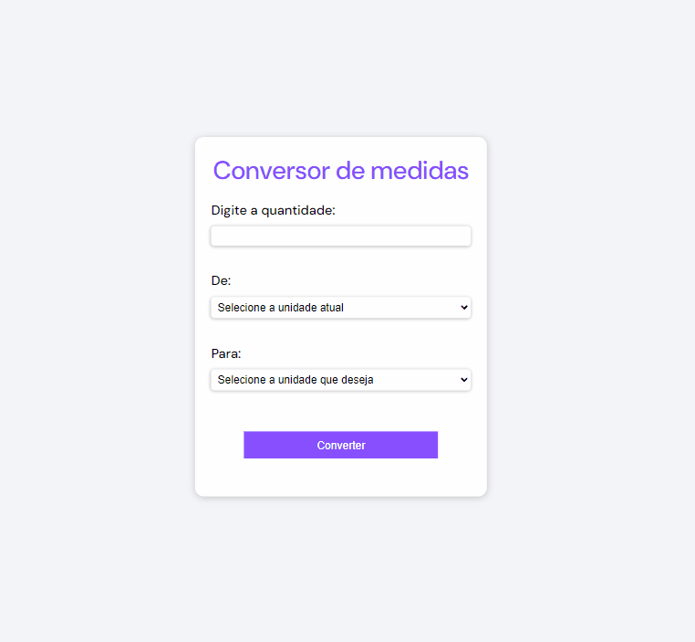

# Conversor de Medidas

## Layout ⚡

 

## Sobre o projeto 🚀

Esta aplicação web foi criada para possibilitar aos usuários a conversão de diversas unidades de medida, tais como metros, quilômetros, centímetros e muitas outras. A interface da aplicação é amigável e intuitiva, permitindo que o usuário insira o valor que deseja converter. Após isso, basta selecionar a unidade de medida de origem e a unidade de destino a partir de práticas listas suspensas. A conversão desejada é exibida de forma instantânea. Ao clicar para enviar o valor para conversão, se caso algum campo não estiver preenchido,uma mensagem de "campo obrigatório" aparece embaixo do campo que não foi preenchido. Caso os campos para selecionar as unidades forem iguais uma mensagem aparecerá para que o usuário escolha uma unidade de medida válida.

 

## O que eu aprendi 🤓

Com esse projeto pude colocar em prática a interação dinâmica com elementos da página por meio da manipulação do DOM. Aperfeiçoar minhas habilidades em lógica de programação, manipulação de eventos e resolução de problemas.

## Acesso a página 💻

Se você quiser conferir o projeto pronto [clique aqui ](https://claricassia.github.io/Conversor-de-medidas/)

## Tecnologias utilizadas 🪄⌨️🖱️

 ☑️HTML 
 ☑️ CSS 
 ☑️ JS

